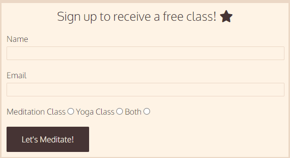

Welcome!

The purpose of this website is to provide information and resources on the topics of yoga and meditation. The target audience is users who are interested in learning more about these practices and who are looking for information.

## Features
Navigation bar

The navigation bar is fully responsive and provides links to the Homepage, the second page and the third page. The navigation bar is displayed on all three pages.
The purpose of the navigation bar is to provide easy access to all 3 pages for the user, and avoids them having to use the 'back' button or re-enter the website URL to get back to the homepage.

Section

The section part is dispalyed on both the homepage and on the second page. This is a box which contains the content of these pages.
On the homepage, it provides the user with information about how the website is structured and what they can expect from the other pages. There is also a collage of images..
On the second page, this section contains again a collage of images and in the text section, it provides the users with information on the topics of meditation and yoga. It also contains a link to Spotify and Wikipedia, where users can find additional information.

Sign up form

The sign up form provides the users with the option to enter their name and email address to receive a free class in either yoga or meditation, or both. All requested information is required in order for the form submission to be successful. This redirects to a page where the user sees a thank you message. From this page, they can easily navigate back to page of their choice by using the navigation bar.

Images

Images are displayed on all three pages for esthetic and UI purposes. These are all stock images and are realted to the topics of the website.

Footer

The footer section is displayed on all three pages and contains links to social media platforms. The user can click on these and they will open in a new tab, showing the social media site selected.

Pages

There are three pages on this webiste: Homepage, Meditation&Yoga, Resources.

------

## Testing

Testing:

| Action        | Expected Behaviour  | Result | 
| ------------- | ------------- | ------------- | 
| Enter url of site in browser  | site shows homepage | pass | 
| Click on meditation menu item  | site shows page 2  | pass | 
| Click on resources menu item  | site shows page 3  | pass | 
| Form: Click on submit button without data | form does not submit, error msg  | pass |
| Form: Click on submit button with data  | form submits  | pass |
| Click on spotify playlist items  | music plays  | pass |
| Click on footer items  | social media sites open | pass |

Validator Testing

HTML

No errors were returned when passing through the official W3C validator

CSS

No errors were found when passing through the official (Jigsaw) validator

------

## Deployment

The site was deployed to GitHub pages:

GitHub repository -> Settings tab

Selected 'Pages' and changed source to 'main' and folder to 'root'

Live link for page: https://caoimhed.github.io/meditation-yoga/

Local deployment

Command prompt: git clone and paste https://github.com/caoimheD/meditation-yoga.git

---

## Content credits

Font was selected from Google Fonts: https://fonts.google.com/specimen/Oxygen

Images were taken from the stock images site Unsplash: https://unsplash.com/

Color palette taken from Color Hunt: https://colorhunt.co/palette/4834346b4f4feed6c4fff3e4

Icons taken from Font Awesome: https://fontawesome.com/

Meditation info: https://www.mayoclinic.org/tests-procedures/meditation/in-depth/meditation/art-20045858

---

## Other

---
