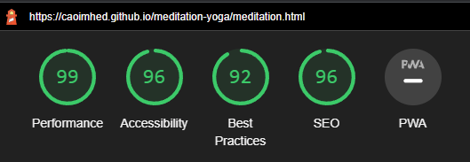

Welcome!

The purpose of this website is to provide information and resources on the topics of yoga and meditation. The target audience is users who are interested in learning more about these practices and who are looking for information.

By navigating through the website, users will be provided with information and links to resources where they can find out more and deepen their understanding of these topics. The layout of the website is explained on the homepage, so they will be able to easily navigate through the different pages by using the navigation links.

## Features

**Navigation bar**

The navigation bar is fully responsive and provides links to the Homepage, the Meditation&Yoga page and the resources page. The navigation bar is displayed on all three pages, allowing users to return to any page of their choice.

The purpose of the navigation bar is to provide easy access to all 3 pages for the user, it also avoids them having to use the 'back' button or re-enter the website URL to reutrn to the homepage.

**Section**

The section part is dispalyed on all 3 pages (homepage, Meditation&Yoga, resources). This is esentially a box which contains the content that is displayed on these pages.

On the homepage, it provides the user with information about how the website is structured and what they can expect from the other pages. There is also a collage of images. To create this, the section box was divided into a 'sidebar' and a 'main' part. The 'main' part is 70% of the width and the 'sidebar' takes up 30% of the width of the section box.

On the meditation and yoga page, this section contains again a collage of images (this time displayed on the right side instead of the left) and in the text section it provides the users with information on the topics of meditation and yoga. It also contains a link to Spotify where users can listen to music to help them with thier meditation session.

On the resources page, the section box does not contain the sidebar with images. On this page, the 'main' section has been given 100% of the width of the box.

**Sign up form**

The sign up form is located on the resources page and provides the users with the option to enter their name and email address to receive a free class in either yoga or meditation, or both. All requested information is required in order for the form submission to be successful. 

Completion of the form redirects to a page where the user sees a thank you message. From this page, they can easily navigate back to page of their choice by using the navigation bar.

**Images**

Images are displayed on all pages, except for the resources page, for aesthetic purposes. These are all stock images and are related to the topics of the website.

**Footer**

The footer section is displayed on all pages of the webiste and it contains links to social media platforms. The user can click on these links and they will open in a new tab, showing the social media site that has been selected.

**Pages**

In total there are 4 pages on this website: Homepage, Meditation&Yoga, Resources and the page that dispalys after fillng in the sign up form. This fourth page is only visible on completion of the form. If users do not use the form, they will have the 3 remaining pages visible to them and accessible through the navigation bar.

------

## Testing

**Feature testing**

| Action        | Expected Behaviour  | Result | 
| ------------- | ------------- | ------------- | 
| Enter url of site in browser  | site shows homepage | pass | 
| Click on meditation menu item  | site shows page 2  | pass | 
| Click on resources menu item  | site shows page 3  | pass | 
| Form: Click on submit button without data | form does not submit, error msg  | pass |
| Form: Click on submit button with data  | form submits  | pass |
| Click on spotify playlist items  | music plays  | pass |
| Click on external links (pg3)  | sites open in new tab  | pass |
| Click on footer items  | social media sites open | pass |

**Validator Testing**

HTML

No errors were returned when passing through the official W3C validator for all 4 HTML pages.

CSS

No errors were found when passing through the official (Jigsaw) validator for the css file.

**Responsiveness testing**

Device responsiveness was tested through the use of Chrome Developer Tools. Different screen sizes were selected and viewed. Testing was also conducted on live devices available to the student, such as iphone and laptop screens.

Based on this testing, the decision was made to remove some of the images on smaller screens (max width 800px) and to reduce the image size on medium screens (max width 950px).

The height and width of the Spotify playlist was also changed on smaller device sizes, along with the navigation menu being displayed vertically insteady of horizontally on screens with a max width of 400px. This change of the navigation bar allows users on mobile screens to still view the menu items in a user friendly manner and be able to click on them without any issue (padding was added so that users would not accidentally click on the wrong menu item on small screens). The options in the sign up form also display vertically on a small screen size for the same reason. This was achieved by adding the options and radio buttons into a 'div' and 'span', which could then be stlyed as part of the media queries.

Other minor adjustments, such as the display and alignment of the lists and list items on the mediation&yoga page, were made for screens with a max width of 1250px based on the testing conducted with Chrome Developer Tools.

The website now has a fully responsive design and users can interact with the features easily on different screen sizes and devices.

**Lighthouse**

Lighthouse testing was conduced through Chrome Developer Tools:

**Other general testing**

While the website was being built, features were tested and viewed through Google Chrome browsers and Chrome Developer Tools and any changes were made based on how the website was displaying. These changes include the colour scheme, font and the choice of images, along with the overall design layout of the website.

------

## Deployment

The site was deployed to GitHub pages:

This was done by going to GitHub repository -> Settings tab. Selected 'Pages' and changed source to 'main' and folder to 'root'

Live link for page: https://caoimhed.github.io/meditation-yoga/

Local deployment:

This was done through Command prompt (git clone and paste https://github.com/caoimheD/meditation-yoga.git)

This means that the site was cloned into a local folder and is now also accessible locally.

---

## Content credits

Font was selected from Google Fonts: https://fonts.google.com/specimen/Oxygen

Images were taken from the stock images site Unsplash: https://unsplash.com/

Color palette taken from Color Hunt: https://colorhunt.co/palette/4834346b4f4feed6c4fff3e4

Icons taken from Font Awesome: https://fontawesome.com/

Meditation info: https://www.mayoclinic.org/tests-procedures/meditation/in-depth/meditation/art-20045858

Yoga info: https://en.wikipedia.org/wiki/Yoga

---
